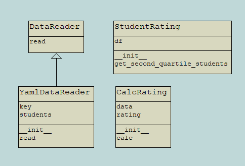

# Лабораторная работа №3 по дисциплине "Администрирование, сопровождение и DevOps"

Это репозиторий для лабораторной №3 по DevOps в ВолгГТУ.

Вариант: 8. Определить и вывести на экран всех студентов, чей рейтинг попадает во вторую квартиль распределения по рейтингам.

Используемые технологии: Python

UML-диаграмма классов:

